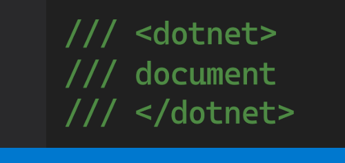
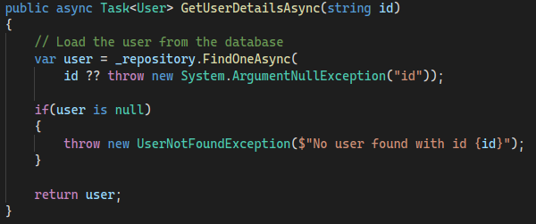
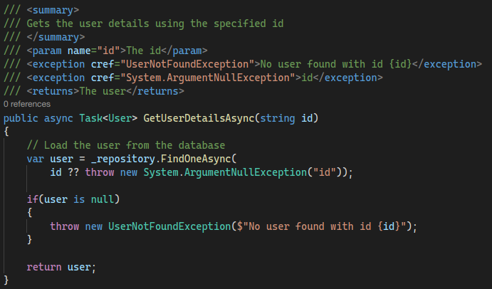

<p align="center">
  
</p>

# dotnet-document


[](https://www.nuget.org/packages/strategy) 
[](https://www.nuget.org/packages/strategy)


A cross platform tool that auto generates an XML doc starting point for your C# codebase.

Thanks to `Microsoft.CodeAnalysis.CSharp` this tool is able to identify undocumented members and to generate a meaningful XML doc by *humanizing* member names.

| **Before** | **After** |
|------------------------------------|---------------------------------|
|||

## Installation

1. Clone this repository
2. Pack projects
    ```shell
   dotnet pack 
   ```
3. Install tool
    ```shell
    dotnet tool install --global --add-source solution_root/src/DotnetDocument.Tools/nupkg dotnet-document
    ```
4. Install [config](https://github.com/linksplatform/Settings/blob/main/dotnet-document-config.yaml)

## How to use

```python
# Documents all *.cs files in the current dir and all sub dirs 
dotnet document apply -c PATH_TO_CONFIG

# Documents the specified .cs file
dotnet document apply ./src/folder/MyClass.cs -c PATH_TO_CONFIG

# Documents all *.cs files in the specified dir and all sub dirs 
dotnet document apply ./src/folder/ -c PATH_TO_CONFIG

# Documents all *.cs files in the specified solution
dotnet document apply ./src/solution.sln -c PATH_TO_CONFIG

# Documents all *.cs files in the specified project
dotnet document apply ./src/folder/project.csproj -c PATH_TO_CONFIG
```
`PATH_TO_CONFIG` - a path to a config file from 4th installation step. Example `/user/dotnet-document-config.yml`

## Acknowledgments
* [Humanizer](https://github.com/Humanizr/Humanizer) - Used for humanizing member names
* [Ensure.That](https://github.com/danielwertheim/Ensure.That) - Used as a guard clause
* [FluentAssertions](https://fluentassertions.com/) - Used for wrinting better assertions
* [Moq4](https://github.com/Moq/moq4) - A mocking library for easier testing
* [xUnit](https://github.com/xunit/xunit) - The test framework
